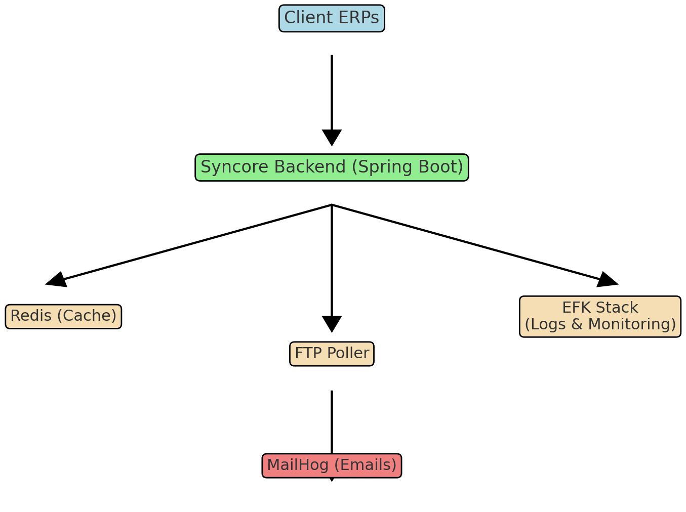

# Syncore – Healthcare Data Integration Platform


A scalable backend system to streamline communication between internal microservices and client-side systems,
with emphasis on performance optimization, fault monitoring, and real-time feedback.

## Features
- API caching and data masking (Spring Boot + Redis)
- FTP poller for patient CSV import
- Email reporting with MailHog integration
- EFK-based log monitoring (Elasticsearch, Fluentd, Kibana)
- Docker + Docker Compose setup

## Getting Started
```bash
docker-compose up --build
```

Visit the app at [http://localhost:8080](http://localhost:8080)  
MailHog UI: [http://localhost:8025](http://localhost:8025)

## License
This project is licensed under the MIT License.

## Architecture

